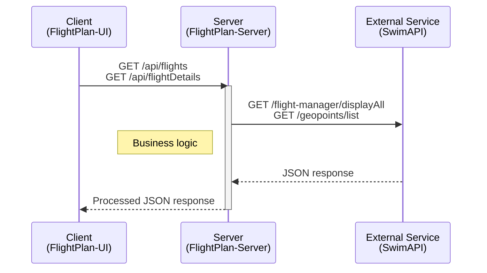
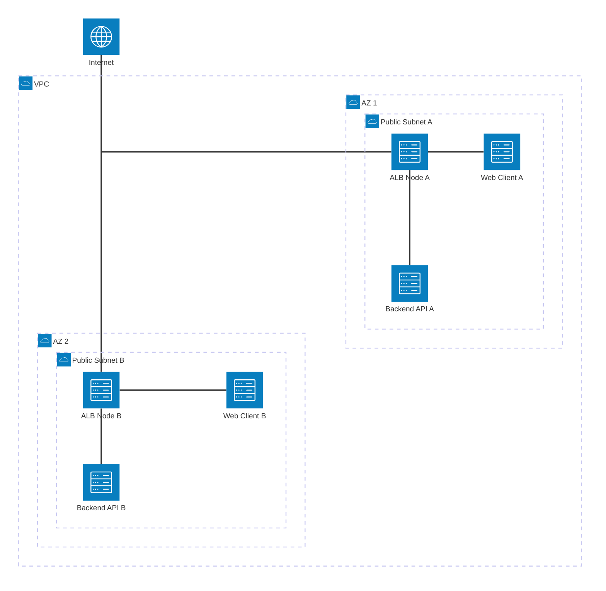
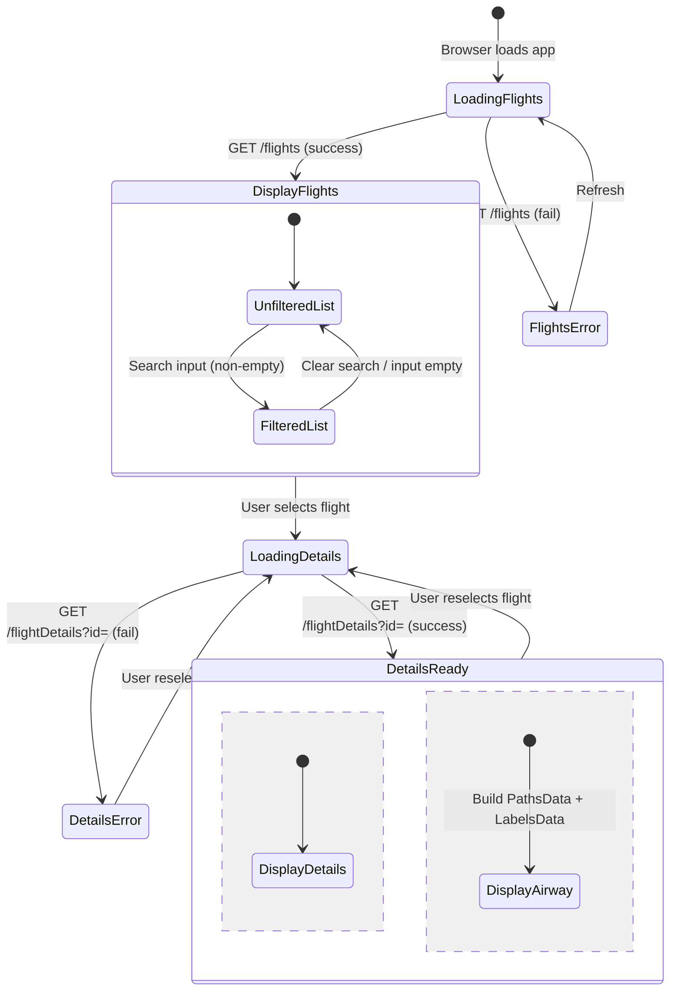
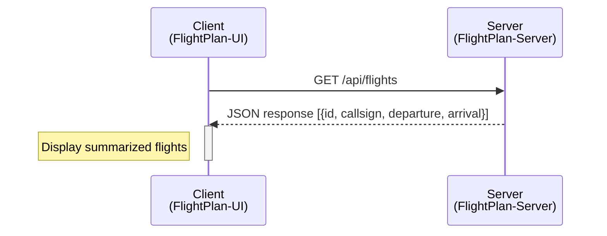
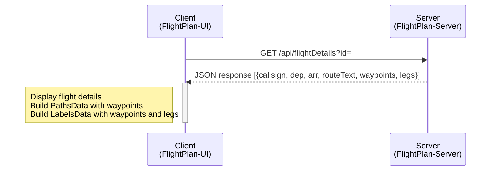

# FlightPlan UI
## Table of Contents
- [1. Solution Overview](#1-solution-overview)
  - [1.1 Tech Stack](#11-tech-stack)
  - [1.2 High-Level Data Flow System Diagram](#12-high-level-data-flow-system-diagram)
  - [1.3 AWS Infrastructure](#13-aws-infrastructure)
  - [1.4 CI/CD](#14-cicd)
- [2. Frontend Client](#2-frontend-client)
  - [2.1 Code Structure](#21-code-structure)
  - [2.2 Key Concepts](#22-key-concepts)
  - [2.3 Setup & Run](#23-setup--run)

## 1. Solution Overview

### 1.1 Tech Stack

#### Frontend
- React (Vite)
- Repository: https://github.com/ST-tienhon/flightplan-ui

#### Backend
- NodeJS
- Repository: https://github.com/ST-tienhon/flightplan-server

#### Containerization
- Docker

#### Cloud Infrastructure (Amazon Web Services)
- Virtual Private Cloud (VPC)
- Application Load Balancer (ALB)
- Elastic Container Services Fargate (ECS)
- Elastic Container Registry (ECR)
- Identity and Access Management (IAM)


### 1.2 High-Level Data Flow System Diagram


### 1.3 AWS Infrastructure
- Virtual Private Cloud (VPC)
  - Subnets for ALB and Fargate services to run in
  - Availability Zones
  - Security groups for traffic to ALB and Task
- Application Load Balancer (ALB)
  - Listeners that routes data to target groups to Fargate services
- Elastic Container Services - Fargate (ECS)
  - Container services that runs dockerized application
- Elastic Container Registry (ECR)
  - Holds docker images
- Identity and Access Management (IAM)
  - Configuration for pushing to ECR and updating to ECS


Enhancement:
- Route53 + ACM
- 2x Private Subnet
- NAT Gateway

### 1.4 CI/CD
- Github Actions
  1. Push code into Github repository
  2. Run automated tests
  3. Build Docker image
  4. Push image to ECR
  5. Create new task definition in ECS
  6. Update service to new task definition


## 2. Frontend Client

### 2.1 Code Structure
```
/flightplan-ui
├─ .github/workflows/
│  └─ ci.yml                         # Github Actions
│
├─ public/
│
├─ src/
│  ├─ assets/
│  ├─ tests/                         # Test cases
│  ├─ App.jsx                        # Main client application
│  ├─ index.css
│  ├─ main.jsx
│  └─ styles.css                     # Main stylesheet for App.jsx
│  
├─ .dockerignore
├─ .gitignore
├─ Dockerfile
├─ README.md
├─ eslint.config.js
├─ index.html
├─ nginx.conf                        # nginx config file for nginx docker image
├─ package-lock.json
├─ package.json
└─ vite.config.js
```
### 2.2 Key Concepts
#### 2.2.1 API for functional frontend
| Method | Endpoint               | Description                       |
| ------ | ---------------------- | --------------------------------- |
| GET    | /api/flights           | Summarized list of all flights    |
| GET    | /api/flightDetails?id= | Flight details of selected flight |

#### 2.2.2 Frontend Application State Lifecycle


#### 2.2.3 Flights Panel


#### 2.2.4 Flight Details Panel


#### 2.2.5 Flight Path Panel
PathsData contains the Airports, Fixes, Navaids lat lon in sequence for drawing the paths.
```
[[79.89, 7.18], [79.87, 7.16], [90.4, 4.41], [94.85, 3.27], [97.61, 3.44]]
```
LabelsData contains the Airports, Fixes, Navaids name and lat lon.
```
[{id: "wp-DEP", type: "waypoint", text: "DEP", lat: 7.18, lng: 79.89, …},
{id: "wp-W1", type: "waypoint", text: "W1", lat: 7.16, lng: 79.87, …},
{id: "wp-W2", type: "waypoint", text: "W2", lat: 4.41, lng: 90.4, …},
{id: "wp-W3", type: "waypoint", text: "W3", lat: 3.27, lng: 94.85, …},
{id: "wp-W4", type: "waypoint", text: "W4", lat: 3.44, lng: 97.61, …},
{id: "wp-ARR", type: "waypoint", text: "ARR", lat: 2.21, lng: 101.56, …},
{id: "airway-0-A1", type: "airway", text: "A1", lat: 5.785, lng: 85.135, …},
{id: "airway-1-A1", type: "airway", text: "A1", lat: 3.84, lng: 92.625, …},
{id: "airway-2-A2", type: "airway", text: "A2", lat: 3.355, lng: 96.22999999999999, …}]
```
Visual representation of the Airway

```mermaid
flowchart LR

    %% Styling
    classDef dep fill:#0b3d91,color:#fff,stroke:#0b3d91,stroke-width:2px;
    classDef arr fill:#2e8b57,color:#fff,stroke:#2e8b57,stroke-width:2px;
    classDef wp fill:#f2f2f2,color:#111,stroke:#555,stroke-width:1.5px;
    classDef airway fill:#f2f2f2,color:#111,stroke:#555,stroke-width:1px,font-size:10px;

    %% Nodes
    DEP((DEP)):::dep
    W1((W1)):::wp
    A1((A1)):::airway
    W2((W2)):::wp
    A1B((A1)):::airway
    W3((W3)):::wp
    A2((A2)):::airway
    W4((W4)):::wp
    ARR((ARR)):::arr

    %% Route
    DEP e1@--- W1 e2@--- A1 e3@--- W2 e4@--- A1B e5@--- W3 e6@--- A2 e7@--- W4 e8@--- ARR
    e1@{ animation: slow }
    e2@{ animation: slow }
    e3@{ animation: slow }
    e4@{ animation: slow }
    e5@{ animation: slow }
    e6@{ animation: slow }
    e7@{ animation: slow }
    e8@{ animation: slow }
```


Main component for visualization of airway route on a globe `globe.gl`.  
Repository: https://github.com/vasturiano/globe.gl  

Populate globe.gl properties with PathsData and LabelsData. Airway routes with labels will be drawn.  
Enhancing UI/UX by:
- Animating path for direction of flight.
- Adding colours for Arrival and Departure airports.
- Center the path for convenience.


### 2.3 Setup & Run

#### Local Development
##### System Requirements
-Ubuntu 24.04

##### Update System
```bash
sudo apt update
sudo apt upgrade -y
```

##### Install Node version manager (NVM), Node.js
```bash
sudo apt install curl build-essential -y
curl -o- https://raw.githubusercontent.com/nvm-sh/nvm/v0.40.4/install.sh | bash
nvm install 24
```

##### Local Environment
```bash
git clone https://github.com/ST-tienhon/flightplan-ui.git
cd flightplan-ui
```

##### Running Application (development)
```bash
npm install
npm run dev
```
Points to `http://localhost:3000` for backend as specified in `vite.config.js`.

##### Docker Run
```bash
docker build -t client .
docker run -d -p 80:80 client:latest
```
For running docker locally, consider running both backend and frontend concurrently via docker compose.